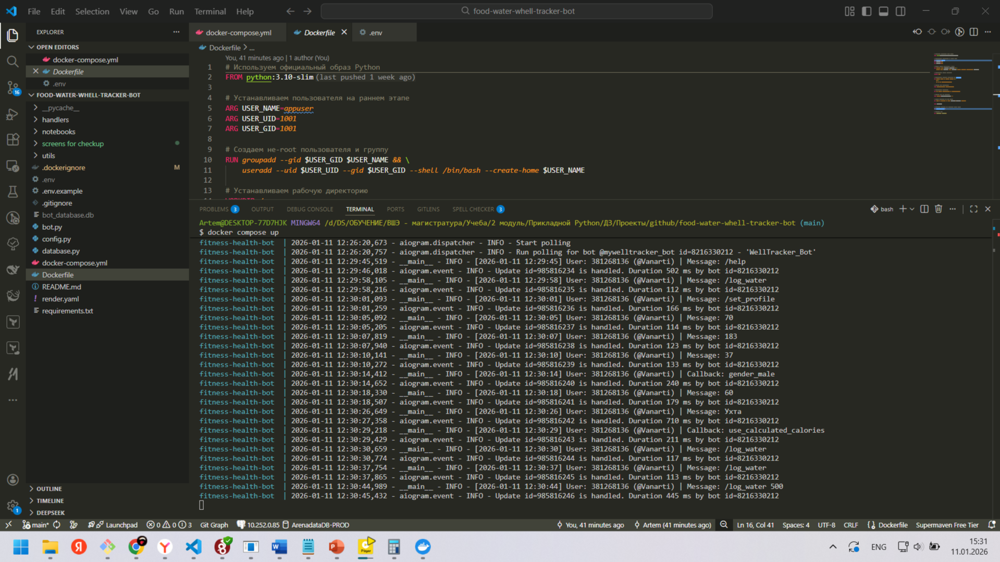

# Скриншоты работы приложения

## Демонстрация функциональности бота

### Deploy на render.com

### /start

### /set_profile

### результат заполнения профиля через /set_profile

### реузльтаты логирования на render.com

### /log_water

### /log_food

### /log_workout

### /log_workout

### /check_progres

### графики /show_cahrts (дополнительно)

### рекомендации /recommendations (дополнительно)

### пример логирования и работы при локальном деплое

